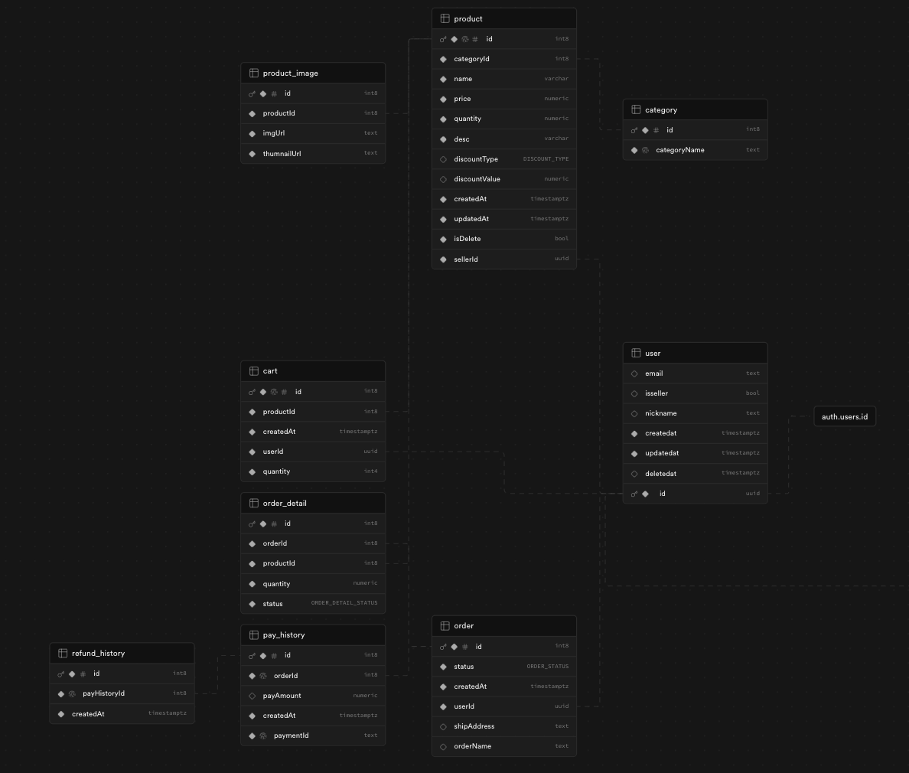
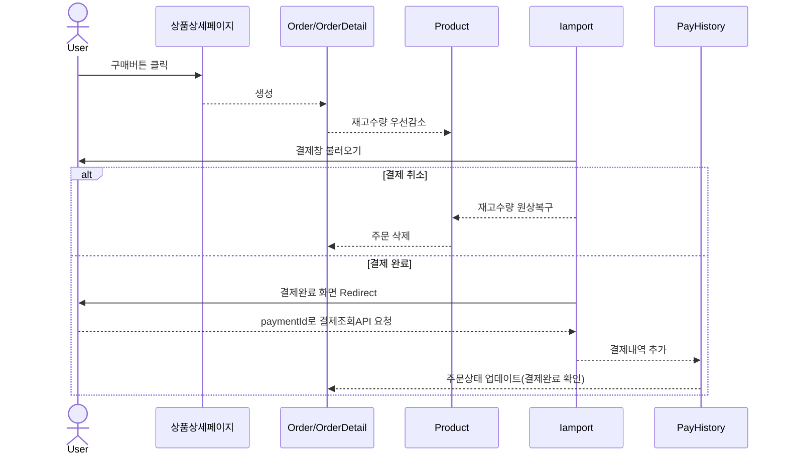
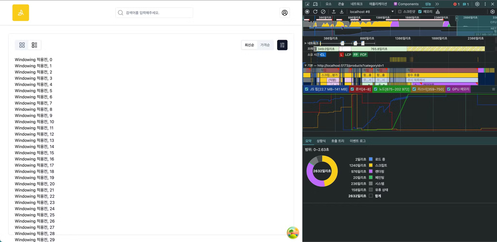
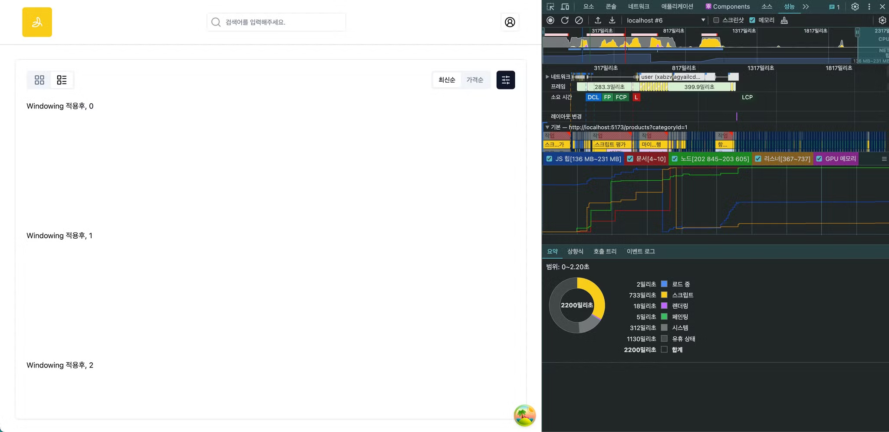

# Banana Store

> 프로젝트 회고문서 : https://dolphin-pc.notion.site/14a2ffc42d5d492da5cdb5b5c44fdc1e?v=1089870838e380b1861b000cc6e8857f&pvs=4

> 프로젝트 Issues : https://github.com/Dolphin-PC/Commerce/issues?q=is%3Aissue+is%3Aclosed

## 📌 프로젝트 소개

- **상품 결제**를 중심으로 한 E-Commerce 프로젝트입니다.

### ⚙️ 사용기술


<br/>
<small>Typescript/관계형 DB의 지원이 있어 선택하게 되었습니다.</small>
<br/>


<br/>

<small>라이브러리에 종속되지 않고, Copy&Paste방식으로 커스텀이 용이하여 선택했습니다.</small>
<br/>

<small>TS타입의 안정성과 유효성검증과정에 있어 Yup보다 더 적합하다고 판단했습니다. </small>
<br/>

<small>jest보다 테스트설정 작업이 간단하여 선택했습니다.</small>
<br/>
<small>E2E테스트를 위해 도입했습니다.</small>

### 🔨 아키텍처

#### Database

- 크게 `user`, `product`, `order`, `pay_history` 가 있습니다.
  

#### FE Folder구조

- FSD를 기반으로 `app > widgets > pages > features > shared` 순으로 참초할 수 있는 계층을 나누었습니다.
  (왼쪽에서 오른쪽은 참조가능하나, 오른쪽에서 왼쪽은 참조가 불가합니다.)

  - **app** : 어디에도 재사용되지 않습니다. 주로 앱 설정과 관련된 파일입니다. (ex. Router)
  - **widgets** : 특정 feature기능들의 조합으로 만들어진 components가 위치합니다. (Header)
  - **pages** : 화면단위로 나눈 컴포넌트입니다.
  - **features** : 도메인 단위로 나눈 컴포넌트입니다. (@가 붙은 폴더는 DB와 관련되지 않습니다.)
  - **shared** : 어디에도 종속되지 않는 컴포넌트로, 재사용성이 가장 높습니다.

  <details>
  <summary>폴더구조 펼치기</summary>

  ```
  📦src
  ┣ 📂app
  ┃ ┣ 📂Common
  ┃ ┣ 📂providers
  ┃ ┣ 📂routers
  ┃ ┣ 📜App.tsx
  ┃ ┣ 📜index.css
  ┃ ┗ 📜main.tsx
  ┣ 📂features
  ┃ ┣ 📂@auth
  ┃ ┣ 📂@portOne
  ┃ ┣ 📂@storage
  ┃ ┣ 📂cart
  ┃ ┣ 📂category
  ┃ ┣ 📂order
  ┃ ┣ 📂order_detail
  ┃ ┣ 📂pay_history
  ┃ ┣ 📂product
  ┃ ┣ 📂product_image
  ┃ ┣ 📂refund_history
  ┃ ┗ 📂user
  ┣ 📂pages
  ┃ ┣ 📂CartPage
  ┃ ┣ 📂DashBoardPage
  ┃ ┣ 📂DashboardOrderDetailPage
  ┃ ┣ 📂DashboardOrderPage
  ┃ ┣ 📂DashboardProductDetailPage
  ┃ ┣ 📂DashboardProductEditPage
  ┃ ┣ 📂DashboardProductNewPage
  ┃ ┣ 📂DashboardProductPage
  ┃ ┣ 📂HomePage
  ┃ ┣ 📂MyOrderDetailPage
  ┃ ┣ 📂MyOrderPage
  ┃ ┣ 📂MyPage
  ┃ ┣ 📂OrderPage
  ┃ ┣ 📂OrderRedirectPage
  ┃ ┣ 📂ProductDetailPage
  ┃ ┣ 📂ProductPage
  ┃ ┣ 📂SignInPage
  ┃ ┣ 📂SignupOAuthPage
  ┃ ┣ 📂SignupPage
  ┃ ┗ 📜Helmets.tsx
  ┣ 📂shared
  ┃ ┣ 📂assets
  ┃ ┣ 📂components
  ┃ ┣ 📂config
  ┃ ┣ 📂consts
  ┃ ┣ 📂hooks
  ┃ ┣ 📂lib
  ┃ ┗ 📂types
  ┣ 📂widgets
  ```

    </details>

## 🎯 서비스 기능

> 서비스에서 제공하는 기능은 다음과 같습니다.

- 회원가입/로그인(Supabase Auth)
- 일반 사용자
  1. 상품구매 (아임포트 연동)
  2. 장바구니
  3. 상품 필터기능 (검색어, 태그, 가격범위)
  4. 구매내역 조회
- 판매자
  1. 판매상품 등록
  2. 주문내역 조회

## 🎯 주요 기능 소개

> ✅ 핵심기능
> 💥 트러블슈팅
> ⚙️ 성능최적화

### ✅💥 1. 아임포트 결제 기능

- 아임포트 SDK를 활용해 가상결제 기능을 구현했습니다.




- [💥 아임포트 redirectUrl](https://dolphin-pc.notion.site/redirectUrl-5bb15243d15340ae9710ddf9b95cd734?pvs=4)

### ⚙️ 2. 상품 이미지 최적화(Lazy Loading)

- 사용자의 화면이 viewport 영역에 들어온 이미지만 로드하여, 웹페이지 초기 로딩 속도를 개선했습니다.
- [📝 이미지 최적화 1. Image Lazy Loading](https://dolphin-pc.notion.site/1-Lazy-Loading-b7f6ffe10c034ef1aa2aa1cbfc255440?pvs=4)
  

### 💥⚙️ 3. 상품 이미지 최적화(Image Resize & Webp), 사이즈 50%감소

- 상품 이미지가 많은 이커머스 사이트 특성을 고려하여, 이미지 사이즈를 감소하여 로딩 속도를 개선했습니다.
- 상품 목록화면의 경우, 이미지 thumnail을 적용해 **이미지 사이즈를 50% 감소**시켰습니다. (157KB -> 64.3KB)
- [📝 이미지 최적화 2. Image Resize](https://dolphin-pc.notion.site/2-Image-Resize-1eafb2f29fa5431383f5c51f38c6e506?pvs=4)

<div style="display:flex;">


</div>

### 💥⚙️ 4. React Windowing, 렌더링 지연 98%감소

- 무한 스크롤 기능으로 인해, 많은 컴포넌트가 쌓이게 된다면 렌더링의 지연이 발생하게 됩니다.
- 이를 개선하기 위해, 뷰포트의 화면 외 컴포넌트는 렌더링되지 않도록 windowing기법을 도입했습니다.
  

- 10만개의 데이터로 테스트했을 때, 초기 렌더링 시간이 `976ms > 16ms로, 98%감소`된 것을 확인할 수 있었습니다.
- [📝 react-window](https://dolphin-pc.notion.site/react-window-41289d25da9a42c4bab241166d760a6d?pvs=4)

<div style="display:flex;">


</div>
